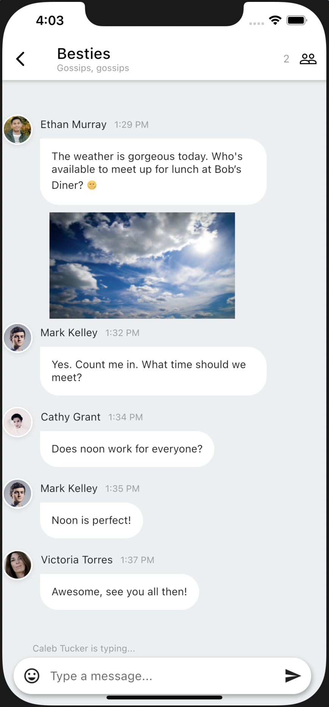
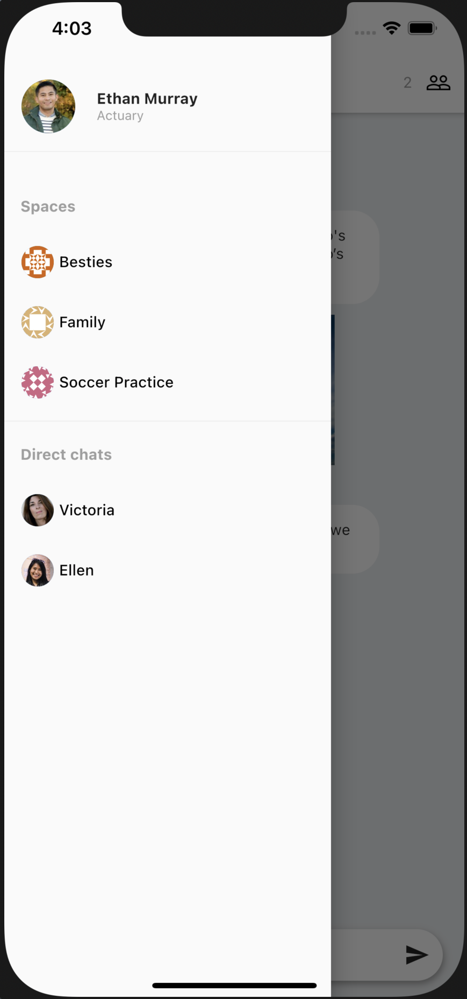
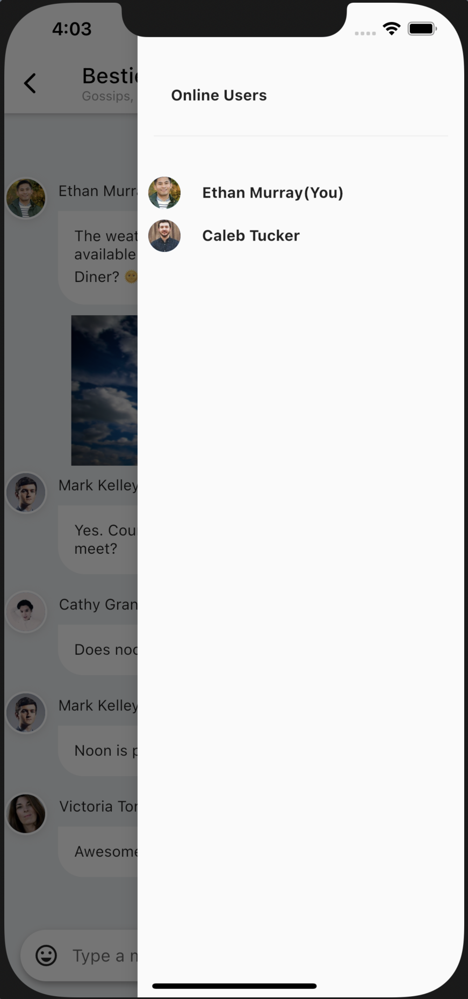

# PubNub Chat App

The Simple chat app demonstrates how to build a chat application using [PubNub Chat](https://www.pubnub.com/docs/chat/quickstart) and [PubNub Dart SDK](https://www.pubnub.com/docs/sdks/dart). Learn how to add private messaging and group messaging features in general chat application. Learn how to build features like send/receive messages, typing indicators, online members list. You can download the project to run on your local machine, and explore the code to see how we built it.

 |  |  |
--- | ---- | ---- |

The application uses [PubNub](https://www.pubnub.com/) service with [Dart SDK](https://pub.dev/packages/pubnub).

## Prerequisites

- [Flutter](https://flutter.dev/docs/get-started/install)
- [PubNub Account](#pubnub-account) (*Free*)

## PubNub Account

To run this application you must obtain publish and subscribe keys from your PubNub Account. If you don't already have an account, you can [create one for free](https://dashboard.pubnub.com/).

1. Sign in to your [PubNub Dashboard](https://dashboard.pubnub.com/).

1. Click **Create New App**.

1. Give your app a name, and select **Chat App** as the app type.

1. Select a region to store your user data (e.g. *Portland*).

1. Click **Create**.

1. Click your new app to open its settings, then click its keyset.

1. Locate the *Publish* and *Subscribe* keys. Include these keys in this project's `.env` file.

## Running the project

1. Clone the GitHub repository.

    ```bash
    git clone https://github.com/pubnub/flutter-ref-app-simple-chat.git
    ```

1. Add `.env` file with keyset values as described in `.env.sample`.

    ```dart
    PUBNUB_SUBSCRIBE_KEY="<Enter Your PubNub Publish Key Here>"
    PUBNUB_PUBLISH_KEY="<Enter Your PubNub Subscribe Key Here>"
    ```

1. Install the dependencies.

    ```bash
    cd flutter-ref-app-simple-chat
    flutter pub get
    ```

1. Start an simulator or connect your device and run application with selected device.

    ```bash
    flutter run
    ```

## Further Information

Visit the [PubNub Dart SDK Docs](https://www.pubnub.com/docs/sdks/dart) page for more information about how to use PubNub Dart SDK.
Please refer [Flutter Install](https://flutter.dev/docs/get-started/install) page for flutter framework and simulator setup.